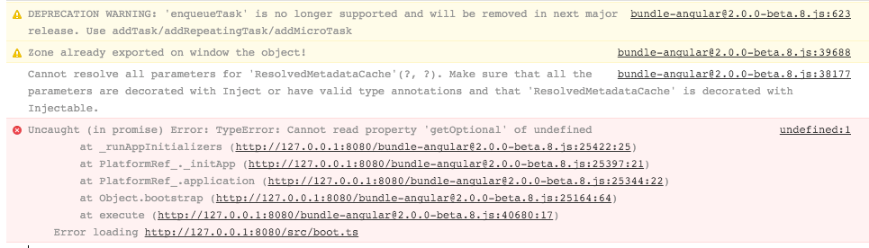

# JSPM 0.17.0-beta.12 and Angular2 2.0.0-beta.8 test

This repository is intended to demonstrate a suspected issue with JSPM 0.17.0-beta.12 bundling with Angular 2.

## Installation

```
npm i && cd www && jspm i && cd ..
```

## Scripts

- test
- test-bundle

### test

This script runs the non-bundled version of this test project.

```
npm run test
```

### test-bundle

This script runs the bundled version of this test project.

```
npm run test-bundle
```

**Note:** If you run `test-bundle` after `test` you might need to refresh the browser to ensure it's not running from cache.  If it works, it's likely cached.

## Console Error

For ease of reference, here's the error which occurs when trying to run the bundle for this test project.


